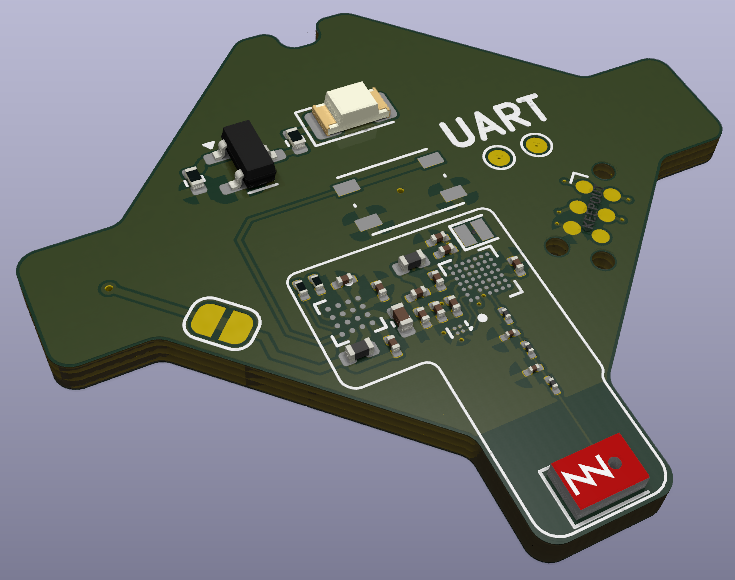

# PCA20073 Tiny Board - nRF54L15 Coin Cell Board 
A very small demo board showing the solution size of Nordic's nRF54L15 in chip-scale package.
Alongside our components are our partners' products: **SiTime's** <0.5x0.5mm MEMS resonator, **Ignion's** 3x2mm 2.4G-10.6Hz chip antenna, **Analog Device's** new micropower 3-axis accelerometer

    

## Key components

| Reference Designator | Part Number        | Description                                                                                                |
|----------------------|--------------------|------------------------------------------------------------------------------------------------------------|
| U1                   | nRF54L15-CAAA      | [Nordic Semiconductor nRF54L15 Series - Advanced multiprotocol System-on-Chip (SoC) supporting Bluetooth Low Energy, ANT, 802.15.4, Thread, Zigbee, and proprietary 2.4 GHz protocols.](https://www.nordicsemi.com/Products/nRF54L15) |
| Y2                   | SiT11100-A6-032.0000-E6035-T325           | [SiTime ultra-small 0505 Size 32 MHz MEMS Resonator.](www.sitime.com/products/mems-resonators/sit11100)     |
| AE1                  | NN02-101           | [Ignion NANO mXTEND - Ultra-small 2.4GHz chip antenna utilizing Virtual Antenna® technology.](https://ignion.io/product/nano-mxtend/)                |
| U3                   | ADXL366            | [Analog Devices ADXL366 - Micropower, 3-Axis, ±2g/±4g/±8g Digital Output MEMS Accelerometer.](https://www.analog.com/en/products/adxl366.html)                |

## System Features
- Low Vf blue LED for indication
- Tag-Connect TC2030 for debug port
- UART TX/RX pads for testing
- Jumper for system power characterization using the [PPK2](https://www.nordicsemi.com/Products/Development-hardware/Power-Profiler-Kit-2)

## Possible Usecases
- BLE Beacon
- Channel sounding reflector
