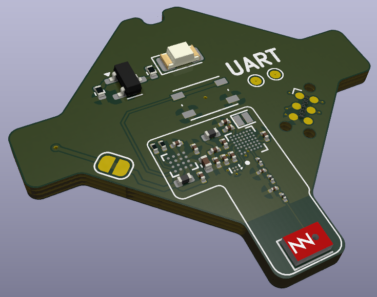

# nRF54L15 + nPM2100 Coin Cell Backpack
A very small demo board showing the solution size of Nordic's nRF54L15 and nPM2100.
Alongside our components are our partners' products: SiTime's <0.5x0.5mm MEMS oscillator and Ignion's 3x2mm chip antenna.

    

## System Features
- nRF54L15
- nPM2100 with Maximum Energy Extraction for extended device life
- SiTime ST11100 ultra-small 32MHz MEMS oscillator
- Ignion NANO mXTEND ultra-small 2.4GHz chip antenna
- Low Vf blue LED for indication
- Push button demonstrating nPM2100 nA ship mode
- Tag-Connect TC2030 for debug port
- UART TX/RX pads for testing
- Jumper for system power characterization using the [PPK2](https://www.nordicsemi.com/Products/Development-hardware/Power-Profiler-Kit-2)

## Possible Usecases
- BLE Beacon
- Channel sounding reflector
